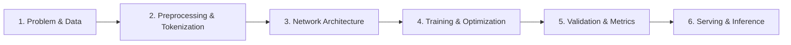
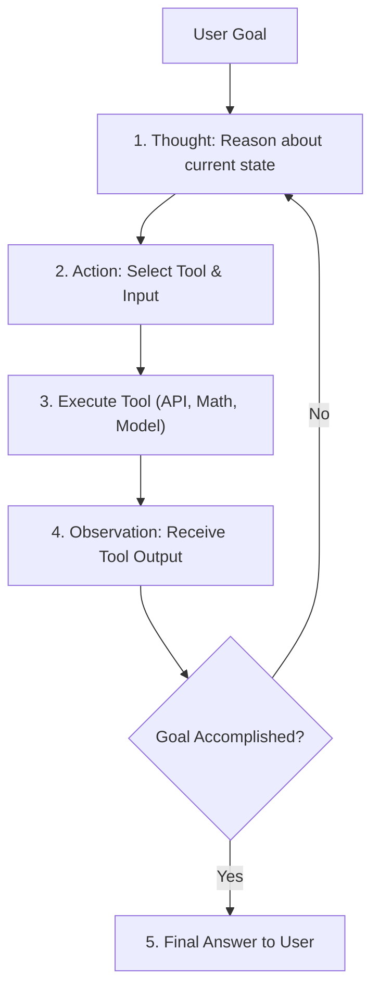

# 🧠 NeuroNexus AI (Genesis Framework)
### *An End-to-End Master Blueprint for Deep Learning Neural Models & Autonomous ReAct Agents*

[](https://www.python.org/)
[](https://pytorch.org/)
[](https://arxiv.org/abs/2210.03629)
[](LICENSE)

Welcome to **NeuroNexus AI**! This repository is designed to teach and demonstrate how production-grade AI systems are architected, structured, and implemented. It unites a **PyTorch Deep Learning Model** (for text sentiment and intent classification) with an **Autonomous Agentic AI Engine** (ReAct framework: Thought $\rightarrow$ Action $\rightarrow$ Observation), demonstrating how agents can orchestrate custom deep learning models alongside external tools.

---

## 📑 Table of Contents
1. [📘 Deep Architecture Manual (howitworks.md)](howitworks.md)
2. [🎓 Developer Masterclass Guide (docs/AI_DEVELOPER_GUIDE.md)](docs/AI_DEVELOPER_GUIDE.md)
3. [🔍 Execution & Diagnosis Report (explain.md)](explain.md)
4. [Project Anatomy & Directory Structure](#-1-project-anatomy--directory-structure)
5. [AI Models vs. AI Agents: The Fundamental Difference](#-2-ai-models-vs-ai-agents-the-fundamental-difference)
6. [The 6-Stage Process to Build an AI Model](#-3-the-6-stage-process-to-build-an-ai-model)
7. [The 6-Stage Process to Build an AI Agent](#-4-the-6-stage-process-to-build-an-ai-agent)
8. [Quick Start & Interactive Workbench](#-5-quick-start--interactive-workbench)
9. [How the Agent Uses the Trained Model](#-6-how-the-agent-uses-the-trained-model)
10. [Extending with Cloud LLMs (Gemini / OpenAI)](#-7-extending-with-cloud-llms-gemini--openai)

---

## 📂 1. Project Anatomy & Directory Structure

A production-grade AI codebase separates **configuration**, **data pipelines**, **model weights**, **agent reasoning logic**, and **test suites**:

```
GEN_AI/
│
├── .vscode/                        # Editor settings (interpreter path & extraPaths)
│   └── settings.json
│
├── config/                         # Configuration layer
│   └── config.yaml                 # Hyperparameters, model dimensions, agent limits
│
├── data/                           # Data storage layer (tracked via DVC / git-lfs)
│   ├── raw/                        # Immutable raw inputs (CSVs, JSON, text dumps)
│   └── processed/                  # Tokenized, cleaned, or cached tensors
│
├── docs/                           # Documentation masterclass
│   └── AI_DEVELOPER_GUIDE.md       # Comprehensive deep-dive tutorial and theory
│
├── models/                         # Model artifact store
│   └── saved_weights/              # Saved model weights (*.pt) & vocabulary (*.json)
│
├── src/                            # Modular source code package
│   ├── __init__.py
│   ├── core/                       # Foundational utilities
│   │   ├── __init__.py
│   │   └── config.py               # Pydantic schema validation & YAML parser
│   │
│   ├── model/                      # Subsystem 1: Neural Network / ML Model
│   │   ├── __init__.py
│   │   ├── dataset.py              # Tokenizer, vocabulary builder, PyTorch Dataset
│   │   ├── network.py              # PyTorch Neural Network architecture (Embedding + MLP)
│   │   ├── trainer.py              # Training loop, loss functions, validation, saving
│   │   └── predictor.py            # High-performance inference engine for scoring
│   │
│   └── agent/                      # Subsystem 2: Agentic AI Engine
│       ├── __init__.py
│       ├── tools.py                # Tool registry (Calculator, SentimentClassifier, KnowledgeBase, DateTime)
│       ├── memory.py               # Working memory, scratchpad, and execution trajectory
│       └── react_agent.py          # Autonomous ReAct loop (Thought -> Action -> Observation)
│
├── tests/                          # Automated unit and integration test suite
│   ├── __init__.py
│   ├── test_model.py               # Tests forward pass, shapes, trainer, and predictor
│   └── test_agent.py               # Tests tool invocation, memory updates, and agent steps
│
├── explain.md                      # Detailed diagnostic & debugging report
├── howitworks.md                   # Comprehensive technical architecture & performance guide
├── main.py                         # Unified Command Line Interface & interactive workbench
├── pyrightconfig.json              # Python static type analysis configuration
├── requirements.txt                # Production package dependencies
└── README.md                       # Project overview & documentation
```

---

## ⚖️ 2. AI Models vs. AI Agents: The Fundamental Difference

| Dimension | AI Model (ML / DL / LLM) | AI Agent (Agentic System) |
| :--- | :--- | :--- |
| **Nature** | Mathematical function: $y = f(x)$ | Autonomous loop: Goal $\rightarrow$ Plan $\rightarrow$ Act $\rightarrow$ Observe $\rightarrow$ Reflect |
| **Output** | A single prediction, probability, or token sequence | Multi-step actions, tool calls, and real-world side effects |
| **Agency** | Passive: waits for input, gives output, stops | Active: decides *how many* steps and *which tools* to use |
| **Memory** | Stateless (unless passed in context window) | Stateful: maintains working memory, scratchpad, and trajectory |
| **Environment** | Isolated tensor space | Interacts with APIs, math engines, databases, and local files |

---

## 🛠️ 3. The 6-Stage Process to Build an AI Model



### Stage 1: Problem Definition & Data Curation
* In [`src/model/dataset.py`](file:///c:/Users/Aasawari%20Bodke/GEN_AI/src/model/dataset.py), we define three discrete sentiment classes: `Negative (0)`, `Neutral (1)`, and `Positive (2)`.

### Stage 2: Tokenization & Representation
* Text is split into words, assigned vocabulary IDs (`vocab.json`), and padded or truncated to a uniform tensor length (`max_len = 32`).

### Stage 3: Neural Architecture ([`src/model/network.py`](file:///c:/Users/Aasawari%20Bodke/GEN_AI/src/model/network.py))
* `SentimentClassifierNet`:
  1. `nn.Embedding`: Maps token IDs to 64-dimensional dense vectors.
  2. **Average Pooling**: Aggregates token embeddings into a fixed sentence representation.
  3. `nn.Linear` + `nn.ReLU`: Non-linear feature transformation.
  4. `nn.Dropout(0.2)`: Drops 20% of neuron outputs during training to prevent overfitting.
  5. `nn.Linear`: Projects hidden dimensions to 3 class logits.

### Stage 4: Training & Optimization ([`src/model/trainer.py`](file:///c:/Users/Aasawari%20Bodke/GEN_AI/src/model/trainer.py))
* **Loss Function**: `nn.CrossEntropyLoss()` measures the gap between predicted distributions and true labels.
* **Optimizer**: `torch.optim.Adam()` dynamically adjusts learning rates across weights.

### Stage 5: Evaluation & Validation
* Dataset is partitioned into **Train (80%)** and **Validation (20%)** sets. Checkpointing saves the best performing weights to `models/saved_weights/sentiment_model.pt`.

### Stage 6: Inference Pipeline ([`src/model/predictor.py`](file:///c:/Users/Aasawari%20Bodke/GEN_AI/src/model/predictor.py))
* Evaluates text with `model.eval()`, turns off gradient tracking (`torch.no_grad()`), and applies `Softmax` to generate probability distributions.

---

## 🤖 4. The 6-Stage Process to Build an AI Agent



### Stage 1: Define Tools & Capabilities ([`src/agent/tools.py`](file:///c:/Users/Aasawari%20Bodke/GEN_AI/src/agent/tools.py))
* Each tool is wrapped with a clean Pydantic schema: `name`, `description`, and `func`.
* Built-in tools: `Calculator`, `DateTime`, `KnowledgeBase`, and `SentimentClassifier`.

### Stage 2: Establish Working Memory ([`src/agent/memory.py`](file:///c:/Users/Aasawari%20Bodke/GEN_AI/src/agent/memory.py))
* Stores the goal and each reasoning turn (`AgentStep`: Thought, Action, Action Input, Observation, Timestamp).

### Stage 3: Implement ReAct Reasoning ([`src/agent/react_agent.py`](file:///c:/Users/Aasawari%20Bodke/GEN_AI/src/agent/react_agent.py))
* **Dual-Brain Design**:
  * **Online**: Uses Gemini 1.5 Flash or OpenAI GPT-4o-mini if API keys are configured.
  * **Offline**: Uses an autonomous heuristic engine with word-to-number translation, natural math pattern matching, and conversational intent detection.

### Stage 4: Safety & Guardrails
* Exception interception keeps a failed tool from crashing the entire reasoning process.
* Enforces `max_iterations = 6` to prevent infinite execution loops.

### Stage 5: Model Orchestration
* The trained PyTorch neural model is exposed as an agent tool, allowing the agent to evaluate sentiment autonomously.

---

## 🚀 5. Quick Start & Interactive Workbench

### 1. Launch Interactive Workbench
```powershell
python main.py
```

Inside the interactive console (`AI-Workbench>`), use any of the following:

| Input | Description | Example |
| :--- | :--- | :--- |
| **`1`** or **`train`** | Trains the PyTorch neural model | `1` |
| **`2`** or **`predict`** | Evaluates emotional sentiment of text | `2` &rarr; *"This framework is awesome!"* |
| **`3`** or **`agent`** | Runs the autonomous agent on a goal | `3` &rarr; *"Calculate (150 * 4) + 85 and check current time"* |
| **`4`** or **`tools`** | Lists all registered tools | `4` |
| **`calculator`** or **`calc`** | Direct access to the math engine | `calculator` &rarr; `sum(range(20))` |
| **`time`** or **`datetime`** | Checks current system time | `time` |
| **`<any goal text>`** | Direct agent execution | *"What is RAG?"* |
| **`5`** or **`exit`** | Exits the workbench session | `5` |

### 2. Direct CLI Commands (Non-Interactive)
```powershell
# Train the model
python main.py train

# Predict sentiment on raw text
python main.py predict --text "The model converged in record time!"

# Run autonomous agent on a goal
python main.py agent --goal "What is RAG and how does it relate to transformers?"
python main.py agent --goal "Calculate the sum and product of the first twenty whole numbers"

# Run complete test suite (9 tests)
python -m unittest discover tests
```

---

## 🔗 6. How the Agent Uses the Trained Model

In [`src/agent/tools.py`](file:///c:/Users/Aasawari%20Bodke/GEN_AI/src/agent/tools.py):
```python
def create_model_inference_tool() -> Tool:
    def run_model(text: str) -> str:
        predictor = SentimentPredictor()
        res = predictor.predict(text)
        return f"Prediction: {res['label']} (Confidence: {res['confidence']*100:.1f}%)"

    return Tool(
        name="SentimentClassifier",
        description="Analyzes the tone/sentiment of input text using our PyTorch model.",
        func=run_model,
    )
```

When you prompt the agent:
> *"Analyze the tone of 'The customer support was rude and unhelpful' and tell me the current time"*

The agent automatically:
1. Recognizes tone analysis intent &rarr; invokes `SentimentClassifier` &rarr; receives `Negative (89.2%)`.
2. Recognizes time query &rarr; invokes `DateTime` &rarr; receives current UTC timestamp.
3. Chains both observations into a unified final answer!

---

## 🌐 7. Extending with Cloud LLMs (Gemini / OpenAI)

NeuroNexus AI runs **completely offline with zero API costs** out of the box.

To upgrade the agent to dynamic generative planning on open-ended tasks:
1. Create a `.env` file in the project root:
   ```env
   GEMINI_API_KEY="your-gemini-api-key-here"
   # or
   OPENAI_API_KEY="your-openai-api-key-here"
   ```
2. Run `python main.py`. The agent will automatically detect the key and switch to Gemini 1.5 Flash or GPT-4o-mini!

---

## 📚 Further Reading & Deep Dives
* [**How It Works & Case Studies (`howitworks.md`)**](howitworks.md): Detailed component breakdown, terminal walkthroughs, and performance mastery tips.
* [**Developer Masterclass Guide (`docs/AI_DEVELOPER_GUIDE.md`)**](docs/AI_DEVELOPER_GUIDE.md): Deep-dive into tensors, backpropagation, and agent theory.
* [**Diagnostic & Resolution Report (`explain.md`)**](explain.md): Complete post-mortem on environment setup and syntax fixes.
