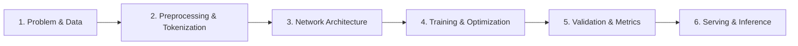
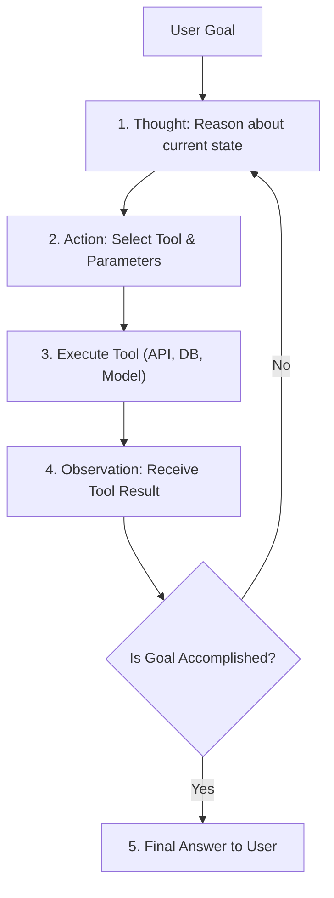

# 🧠 Genesis AI & Agentic Framework
### *An End-to-End Master Blueprint for AI Models and Autonomous AI Agents*

Welcome! This repository is designed to teach you how production-grade AI systems are architected, structured, and implemented. It contains both a **working Deep Learning AI Model** (PyTorch) and a **working Autonomous Agentic AI System** (ReAct framework), showing how they interact seamlessly.

---

## 📑 Table of Contents
1. [📘 The Complete Masterclass Guide (docs/AI_DEVELOPER_GUIDE.md)](docs/AI_DEVELOPER_GUIDE.md)
2. [Project Anatomy & Folder Structure](#-1-project-anatomy--folder-structure)
3. [AI Models vs. AI Agents: The Fundamental Difference](#-2-ai-models-vs-ai-agents-the-fundamental-difference)
4. [The 6-Stage Process to Build an AI Model](#-3-the-6-stage-process-to-build-an-ai-model)
5. [The 6-Stage Process to Build an AI Agent](#-4-the-6-stage-process-to-build-an-ai-agent)
6. [Quick Start & Hands-on Guide](#-5-quick-start--hands-on-guide)
7. [How the Agent Uses the Trained Model](#-6-how-the-agent-uses-the-trained-model)
8. [Extending to Production LLMs](#-7-extending-to-production-llms)

---

## 📂 1. Project Anatomy & Folder Structure

A production-grade AI codebase must separate **configuration**, **data pipelines**, **model weights**, **business logic**, and **tests**.

```
GEN_AI/
│
├── config/                         # Configuration layer
│   └── config.yaml                 # Hyperparameters, model architecture dims, agent limits
│
├── data/                           # Data storage layer (tracked via DVC or git-lfs in production)
│   ├── raw/                        # Immutable raw inputs (CSVs, JSON, text dumps)
│   └── processed/                  # Tokenized, cleaned, or cached tensors
│
├── models/                         # Model artifact store
│   └── saved_weights/              # Saved model weights (*.pt, *.onnx, *.safetensors, vocab.json)
│
├── src/                            # Source code package
│   ├── __init__.py
│   ├── core/                       # Foundational utilities
│   │   ├── __init__.py
│   │   └── config.py               # Pydantic / YAML config parser
│   │
│   ├── model/                      # Subsystem 1: Neural Network / ML Model
│   │   ├── __init__.py
│   │   ├── dataset.py              # Tokenization, vocabulary builder, PyTorch Dataset
│   │   ├── network.py              # PyTorch Neural Network architecture (Embeddings + MLP)
│   │   ├── trainer.py              # Training loop, loss functions, validation, saving
│   │   └── predictor.py            # High-performance inference engine for scoring
│   │
│   └── agent/                      # Subsystem 2: Agentic AI Engine
│       ├── __init__.py
│       ├── tools.py                # Tool registry (Calculator, SentimentClassifier, KnowledgeBase, DateTime)
│       ├── memory.py               # Working memory, scratchpad, and execution trajectory
│       └── react_agent.py          # Autonomous ReAct loop (Thought -> Action -> Observation)
│
├── tests/                          # Automated unit and integration test suite
│   ├── __init__.py
│   ├── test_model.py               # Tests forward pass, shapes, trainer, and predictor
│   └── test_agent.py               # Tests tool invocation, memory updates, and agent steps
│
├── main.py                         # Unified Command Line Interface & interactive workbench
├── requirements.txt                # Python package dependencies
└── README.md                       # Complete documentation & developer guide
```

---

## ⚖️ 2. AI Models vs. AI Agents: The Fundamental Difference

| Dimension | AI Model (ML / DL / LLM) | AI Agent (Agentic System) |
| :--- | :--- | :--- |
| **Nature** | Mathematical function: $y = f(x)$ | Autonomous loop: Goal $\rightarrow$ Plan $\rightarrow$ Act $\rightarrow$ Observe $\rightarrow$ Reflect |
| **Output** | A single prediction, embedding, or token sequence | Multi-step actions, tool calls, and real-world side effects |
| **Agency** | Passive: waits for input, gives output, stops | Active: decides *how many* steps and *which tools* to use |
| **Memory** | Stateless (unless passed in context window) | Stateful: maintains working memory, scratchpad, and long-term storage |
| **Environment** | Isolated tensor space | Interacts with APIs, databases, terminal commands, and local files |

---

## 🛠️ 3. The 6-Stage Process to Build an AI Model



### Stage 1: Problem Definition & Data Curation
- Clearly define the output: Is it classification (discrete classes), regression (continuous values), or generative?
- In `src/model/dataset.py`, we define three classes: `Negative (0)`, `Neutral (1)`, and `Positive (2)`.

### Stage 2: Tokenization & Representation
- Computers only understand numbers, not words.
- We tokenize text into words, assign each unique word an index (`vocab.json`), and map padding (`<pad> = 0`) and unknown words (`<unk> = 1`).

### Stage 3: Neural Architecture (`src/model/network.py`)
- We create `SentimentClassifierNet(nn.Module)`:
  1. `nn.Embedding`: Learns continuous dense representations of tokens.
  2. **Masked Average Pooling**: Aggregates variable-length sentences into a fixed-length vector.
  3. `nn.Linear` + `nn.ReLU`: Non-linear feature transformations.
  4. `nn.Dropout`: Drops neurons randomly during training to prevent overfitting.
  5. `nn.Linear`: Outputs raw unnormalized logits for the classes.

### Stage 4: Training & Loss Function (`src/model/trainer.py`)
- **Loss**: `nn.CrossEntropyLoss()` measures divergence between predictions and true labels.
- **Optimizer**: `torch.optim.Adam()` updates weights via backpropagation (`loss.backward()` and `optimizer.step()`).

### Stage 5: Evaluation & Validation
- Separate data into **Train (80%)** and **Validation (20%)**.
- Never evaluate model quality on data it trained on! Track loss and accuracy over epochs.

### Stage 6: Inference Pipeline (`src/model/predictor.py`)
- Load serialized weights, set `model.eval()`, turn off gradient computation (`with torch.no_grad()`), and apply `softmax` to output normalized confidence percentages.

---

## 🤖 4. The 6-Stage Process to Build an AI Agent



### Stage 1: Define Tools & Capabilities (`src/agent/tools.py`)
- Tools are functions wrapped with:
  - `name`: Identifier (e.g. `Calculator`).
  - `description`: What it does and when the agent should pick it.
  - `func`: The actual callable Python function.

### Stage 2: Establish Working Memory & Scratchpad (`src/agent/memory.py`)
- The agent must remember its history:
  - What did I think?
  - What action did I take?
  - What was the observation?
- Without memory, an agent will loop indefinitely.

### Stage 3: Implement Reasoning Pattern (ReAct) (`src/agent/react_agent.py`)
- **ReAct = Reasoning + Acting**:
  1. `[Thought]`: Deconstruct the prompt into atomic sub-tasks.
  2. `[Action]`: Identify which tool solves the next sub-task.
  3. `[Observation]`: Store result from the tool.
  4. `[Final Answer]`: Synthesize results into human-readable response.

### Stage 4: Guardrails & Safe Execution
- Catch exceptions so a broken tool doesn't crash the agent.
- Enforce `max_iterations` to prevent infinite execution loops.

### Stage 5: Integration with Local & Remote Models
- An agent can call:
  - Local neural models (like our PyTorch classifier).
  - External APIs (Weather, Stock, Database).
  - LLM brains (OpenAI, Gemini, Anthropic, or local Ollama).

---

## 🚀 5. Quick Start & Hands-on Guide

### 1. Run Automated Unit Tests
Verify that all components (dataset, neural net forward pass, trainer, inference engine, tools, memory, and agent) are functional:
```bash
python -m unittest discover -s tests
```

### 2. Train the AI Model
Train the PyTorch text sentiment classifier:
```bash
python main.py train
```
*Output: Saves model weights to `models/saved_weights/sentiment_model.pt` and vocabulary to `models/saved_weights/vocab.json`.*

### 3. Run Real-Time Model Inference
Test the trained model on any sentence:
```bash
python main.py predict --text "I love how fast and clean this AI system is!"
python main.py predict --text "The system threw fatal errors and crashed completely."
python main.py predict --text "The dataset contains five thousand records in CSV format."
```

### 4. Run the Autonomous ReAct Agent
Give the agent multi-step goals requiring tools:

**Example A: Math Calculation**
```bash
python main.py agent --goal "Calculate (45 * 12) + 80"
```

**Example B: Sentiment Analysis + Math (Tool Chaining)**
```bash
python main.py agent --goal "Analyze the tone of 'The customer support was completely unhelpful and rude.' and calculate 15 * 6"
```

**Example C: Technical Concept Knowledge Search**
```bash
python main.py agent --goal "What is ReAct in AI agents?"
```

### 5. Launch the Interactive AI Workbench
Explore all models and agents interactively:
```bash
python main.py interactive
```

---

## 🔗 6. How the Agent Uses the Trained Model

Notice the synergy in `src/agent/tools.py`:
```python
def create_model_inference_tool() -> Tool:
    def run_model(text: str) -> str:
        predictor = SentimentPredictor()
        res = predictor.predict(text)
        return f"Prediction: {res['label']} (Confidence: {res['confidence']*100:.1f}%)"

    return Tool(
        name="SentimentClassifier",
        description="Analyzes the tone/sentiment of input text using our PyTorch model.",
        func=run_model
    )
```
When you ask the agent:
> *"Analyze the sentiment of 'The model converged in record time!' "*

The Agent:
1. Recognizes it needs sentiment classification.
2. Invokes the `SentimentClassifier` tool.
3. Loads your PyTorch neural network.
4. Returns the prediction into its reasoning trajectory.
5. Formulates the final answer.

---

## 🌐 7. Extending to Production LLMs

This starter contains a **zero-cost, offline autonomous reasoning engine** built-in so it works without API keys.

If you have an API key (`GEMINI_API_KEY` or `OPENAI_API_KEY`), simply set it in your environment:

### Windows (PowerShell):
```powershell
$env:GEMINI_API_KEY="your-gemini-key-here"
# or
$env:OPENAI_API_KEY="your-openai-key-here"
```

The agent automatically detects the key and switches from heuristic reasoning to dynamic LLM ReAct reasoning!

---

### 💡 Core Takeaways for Every AI Developer
1. **Models predict; Agents act.**
2. **Never hardcode paths; use `config/config.yaml`.**
3. **Always isolate data preparation from model architecture.**
4. **Tools must have clear descriptions; that is how agents know when to use them.**
5. **Always wrap agent loops with `max_iterations` and robust exception handling.**
