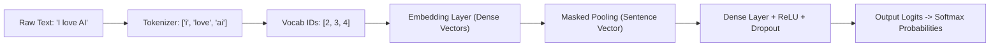
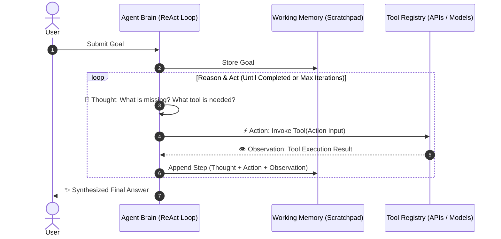

# 🎓 NeuroNexus AI: The Complete AI & Agentic Developer Masterclass Guide
### *A Production-Grade Architectural Blueprint for Building Neural Models and Autonomous ReAct Agents from Scratch*

---

## 📌 Table of Contents
1. [The Big Picture: Classical Code vs. AI Models vs. AI Agents](#1-the-big-picture-classical-code-vs-ai-models-vs-ai-agents)
2. [Anatomy of an AI Model: From Math to Code](#2-anatomy-of-an-ai-model-from-math-to-code)
3. [Anatomy of an AI Agent: The Autonomous Loop](#3-anatomy-of-an-ai-agent-the-autonomous-loop)
4. [The Synergy: Why Modern Agents Orchestrate Small Models](#4-the-synergy-why-modern-agents-orchestrate-small-models)
5. [The Production Engineering Blueprint (Folder Structure Explained)](#5-the-production-engineering-blueprint-folder-structure-explained)
6. [The 6-Step Blueprint to Build an AI Model](#6-the-6-step-blueprint-to-build-an-ai-model)
7. [The 6-Step Blueprint to Build an AI Agent](#7-the-6-step-blueprint-to-build-an-ai-agent)
8. [Codebase Deep Dive: Line-by-Line Understanding](#8-codebase-deep-dive-line-by-line-understanding)
9. [Hands-On Exercises & Labs](#9-hands-on-exercises--labs)
10. [Senior AI Engineer Cheatsheet & Pitfalls to Avoid](#10-senior-ai-engineer-cheatsheet--pitfalls-to-avoid)

---

## 1. The Big Picture: Classical Code vs. AI Models vs. AI Agents

To design intelligent software, you must know which paradigm fits which problem:

```
┌─────────────────────────┬─────────────────────────┬─────────────────────────┐
│     Classical Code      │        AI Model         │        AI Agent         │
├─────────────────────────┼─────────────────────────┼─────────────────────────┤
│ Rules + Data -> Answers │ Data + Answers -> Rules │ Goal + Tools -> Actions │
│                         │                         │                         │
│ • Deterministic logic   │ • Statistical patterns  │ • Dynamic planning      │
│ • Strict `if/else`      │ • Learns weights via    │ • Self-correcting loop  │
│ • Zero adaptability     │   backpropagation       │ • Executes tools/APIs   │
│ • Static workflows      │ • Single-turn mapping   │ • Multi-turn autonomy   │
└─────────────────────────┴─────────────────────────┴─────────────────────────┘
```

### The Biological Analogy
* **Classical Software** is like a **Calculator**: it blindly calculates $(1 + 1 = 2)$ based on fixed silicon gates.
* **AI Model (ML/DL/LLM)** is like the **Sensory Cortex**: it perceives an input and classifies it (e.g. *"This text expresses positive sentiment with 85% confidence"*).
* **AI Agent** is the **Entire Living Organism**: it has a cortex (perception), memory (scratchpad), goals (intent), and hands (tools) that interact with the external world to achieve an objective.

---

## 2. Anatomy of an AI Model: From Math to Code

Every Deep Learning model is fundamentally a continuous mathematical mapping:

$$y = f(x; \theta)$$

Where:
* $x$ is the input representation (tensors/numbers).
* $\theta$ (theta) represents learnable parameters (weights and biases).
* $f$ is the network architecture (convolutions, linear layers, attention heads).
* $y$ is the predicted probability distribution over classes.



### Key Subsystems of an AI Model
1. **Tokenizer & Vocabulary ([`dataset.py`](file:///c:/Users/Aasawari%20Bodke/GEN_AI/src/model/dataset.py))**:
   Text cannot be passed into matrix multiplication directly. We map each distinct word to a discrete integer ID. Special tokens include `<pad>` (index 0, to make all inputs equal length) and `<unk>` (index 1, for words never seen during training).
2. **Dense Embeddings ([`network.py`](file:///c:/Users/Aasawari%20Bodke/GEN_AI/src/model/network.py))**:
   Instead of sparse one-hot vectors, each word ID is transformed into a continuous 64-dimensional vector. Words with similar contextual usage cluster together in this vector space.
3. **Loss Function & Optimization ([`trainer.py`](file:///c:/Users/Aasawari%20Bodke/GEN_AI/src/model/trainer.py))**:
   During training, the model's guess is compared against ground truth using **Cross-Entropy Loss**. Using the chain rule of calculus (**Backpropagation**), gradients flow backwards through each layer, and the **Adam Optimizer** adjusts weights to minimize loss.
4. **Inference Pipeline ([`predictor.py`](file:///c:/Users/Aasawari%20Bodke/GEN_AI/src/model/predictor.py))**:
   In production, we freeze the weights (`model.eval()`), disable gradient calculation (`torch.no_grad()`), and apply `Softmax` to convert raw logits into percentage confidences.

---

## 3. Anatomy of an AI Agent: The Autonomous Loop

An AI Agent is governed by a **Reasoning Loop** rather than a single forward pass.



### The 4 Pillars of Agentic AI
1. **The Brain (Reasoning Engine)**:
   Deconstructs high-level objectives into sequential milestones using the **ReAct** (*Reasoning + Acting*) paradigm.
2. **The Hands (Tool Registry)**:
   A collection of external interfaces with explicit docstrings and type annotations.
   * `Calculator`: Arithmetic and functions (`sum`, `range`, `min`, `max`, `math`).
   * `SentimentClassifier`: Custom-trained PyTorch neural model.
   * `KnowledgeBase`: Keyword & concept retrieval store.
   * `DateTime`: Real-time system clock.
3. **The Notepad (Working Memory & Context)**:
   Maintains the trajectory of what has been tried, what succeeded, and what failed. Prevents repeating failed actions.
4. **The Guardrails**:
   * Enforces `max_iterations` to eliminate infinite loops.
   * Intercepts tool errors gracefully so execution continues.
   * Input sanitization to prevent unsafe command execution.

---

## 4. The Synergy: Why Modern Agents Orchestrate Small Models

A common mistake is assuming large language models should do everything. In production systems:

> **Enterprise Pattern**: Use a General Agent to coordinate specialized Small Models or Neural Networks.

```
                           ┌──────────────────────────┐
                           │    ReAct Agent Brain     │
                           │  (Strategic Orchestrator)│
                           └─────────────┬────────────┘
                                         │
               ┌─────────────────────────┼─────────────────────────┐
               ▼                         ▼                         ▼
      ┌─────────────────┐       ┌─────────────────┐       ┌─────────────────┐
      │ PyTorch Model   │       │   Calculator    │       │  KnowledgeBase  │
      │ (Fast, Local    │       │ (Zero-error     │       │ (Private Vector │
      │  Text Classifier)│       │  Arithmetic)    │       │  Store Search)  │
      └─────────────────┘       └─────────────────┘       └─────────────────┘
```

**Benefits of this Hybrid Architecture:**
* **Speed**: A 2MB PyTorch embedding model runs in 2 milliseconds on a CPU, compared to 800 milliseconds for a cloud LLM call.
* **Cost**: Local inference costs \$0.00.
* **Deterministic Accuracy**: A calculator never hallucinates $45 \times 12$.

---

## 5. The Production Engineering Blueprint (Folder Structure Explained)

```
GEN_AI/
│
├── config/
│   └── config.yaml             # Single source of truth for all configurations
├── data/
│   ├── raw/                    # Immutable ground truth data
│   └── processed/              # Preprocessed, cached, tokenized tensors
├── models/
│   └── saved_weights/          # Serialized model weights (*.pt, vocab.json)
├── src/                        # Production application package
│   ├── core/                   # Shared types, config loader, logging setup
│   ├── model/                  # Neural Model subsystem (dataset, network, trainer, predictor)
│   └── agent/                  # Agentic subsystem (tools, memory, react_agent)
├── tests/                      # Automated unit and integration tests
├── main.py                     # CLI entrypoint and interactive workbench
├── requirements.txt            # Dependency manifest
├── explain.md                  # Diagnostic & post-mortem report
├── howitworks.md               # Technical architecture & performance manual
└── README.md                   # Repository overview
```

---

## 6. The 6-Step Blueprint to Build an AI Model

```
Step 1: Frame the Problem  -> What is input x and what is output y?
Step 2: Collect & Prep     -> Clean, tokenize, and encode into tensors.
Step 3: Network Design     -> Choose layers (Embedding, Linear, CNN, Transformer).
Step 4: Train & Optimize   -> Forward pass -> Loss -> Backward pass -> Step.
Step 5: Validate & Metric  -> Evaluate on unseen validation split.
Step 6: Export & Serve     -> Save checkpoint (.pt) and build an inference class.
```

---

## 7. The 6-Step Blueprint to Build an AI Agent

```
Step 1: Define the Scope    -> What decisions and goals should the agent handle?
Step 2: Engineer Tools      -> Write clear function descriptions and error wrappers.
Step 3: Establish Memory    -> Design a trajectory tracker (Thought, Action, Observation).
Step 4: Build Reasoning     -> Implement the loop (ReAct, Planning, Reflection).
Step 5: Apply Guardrails    -> Add max_iterations, timeout, and exception recovery.
Step 6: Evaluation & Trace  -> Log trajectories to evaluate reliability and speed.
```

---

## 8. Codebase Deep Dive: Line-by-Line Understanding

### 1. PyTorch Neural Network ([`src/model/network.py`](file:///c:/Users/Aasawari%20Bodke/GEN_AI/src/model/network.py))
```python
# Embedding Layer: Maps discrete token ID to a 64-dimensional learned representation
self.embedding = nn.Embedding(vocab_size, embedding_dim, padding_idx=PAD_IDX)

# Masked Pooling: Calculates sentence average while ignoring padding tokens (index 0)
mask = (input_ids != PAD_IDX).unsqueeze(-1).float()
sum_embedded = (embedded * mask).sum(dim=1)
lengths = mask.sum(dim=1).clamp(min=1.0)
pooled = sum_embedded / lengths

# Classification Head: Non-linear transformation and regularization
hidden = self.relu(self.fc1(pooled))
hidden = self.dropout(hidden)
logits = self.fc2(hidden)
```

### 2. The ReAct Agent Loop ([`src/agent/react_agent.py`](file:///c:/Users/Aasawari%20Bodke/GEN_AI/src/agent/react_agent.py))
```python
while iteration < self.max_iterations:
    iteration += 1
    # 1. Reason about next step given history
    thought, action, action_input, is_finished = self._plan_step(goal, self.memory)
    
    if is_finished:
        return thought  # Final answer reached!
        
    # 2. Look up and execute the tool
    tool = self.tools.get(action)
    observation = tool.execute(action_input)
    
    # 3. Store step in memory
    step = AgentStep(thought=thought, action=action, action_input=action_input, observation=observation)
    self.memory.add_step(step)
```

---

## 9. Hands-On Exercises & Labs

### Lab 1: Add a New Tool to the Agent
Open [`src/agent/tools.py`](file:///c:/Users/Aasawari%20Bodke/GEN_AI/src/agent/tools.py) and add a **StringReverser** tool:
```python
def reverse_string(text: str) -> str:
    return text[::-1]

# In get_default_tools():
registry.register(
    Tool(
        name="StringReverser",
        description="Reverses the characters in a given string.",
        func=reverse_string
    )
)
```
Then run:
```powershell
python main.py agent --goal "Reverse the word 'NeuroNexus'"
```

### Lab 2: Connect a Live Cloud LLM (Gemini 1.5 Flash)
1. Get a free API key from [Google AI Studio](https://aistudio.google.com/).
2. Create a `.env` file in your project root:
   ```env
   GEMINI_API_KEY="AIzaSyYourKeyHere..."
   ```
3. Run:
   ```powershell
   python main.py agent --goal "Write a concise 3-step action plan to launch an AI product"
   ```
   The agent will automatically switch from offline heuristic matching to live generative reasoning!

---

## 10. Senior AI Engineer Cheatsheet & Pitfalls to Avoid

| Pitfall | Why It Breaks Systems | Production Solution |
| :--- | :--- | :--- |
| **Evaluating on Training Data** | Model overfits and memorizes; fails on real-world users | Always use strict train/validation splits (`random_split`) |
| **Tool Execution Crashing** | An unhandled exception in an API kills the entire agent | Wrap every tool in `try/except` and feed the error back as an `Observation` |
| **Infinite Agent Loops** | Agent repeats the same failed tool call continuously | Set `max_iterations` and implement repetition-detection in memory |
| **Vague Tool Descriptions** | LLMs hallucinate arguments or pick the wrong tool | Write explicit descriptions stating *when* and *with what parameters* to call |
| **Monolithic Scripts** | Impossible to test in CI/CD pipelines | Modularize into `core`, `model`, `agent`, and `tests` |

---
*Happy Engineering with NeuroNexus AI!*
